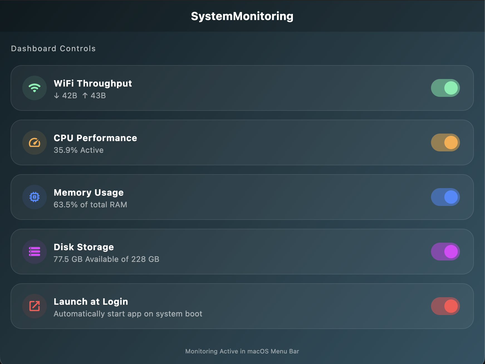
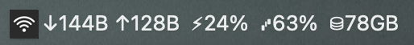
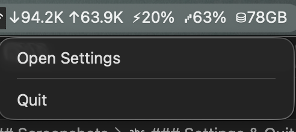

# 🖥️ SystemMonitoring for macOS

[]()
[]()
[]()

A premium, high-performance system monitoring utility for the macOS menu bar. Track your Mac's vitals in real-time with a minimalist aesthetic and a powerful glassmorphic dashboard.


*Modern Glassmorphism Design with Real-time Analytics*

---

## 🎨 Professional Aesthetics

Designed to feel like a native part of macOS, SystemMonitoring combines functionality with high-end design principles:
- **Glassmorphism UI**: Frosted glass effects that respond to your system wallpaper.
- **Dynamic Symbols**: Monochrome icons that adapt perfectly to both Light and Dark modes.
- **Micro-Animations**: Subtle transitions for a premium user experience.

## ✨ Core Features

### 📊 Real-time Monitoring
- **Network Throughput**: Live download (↓) and upload (↑) speeds with auto-scaling units (B, K, M).
- **CPU Performance**: Tracking of active user/sys usage and thermal levels.
- **Memory Pressure**: Real-time percentage of RAM utilization.
- **Disk Health**: Monitor available storage space on your root partition.

### 🔋 Energy Optimized
- **Smart Polling**: Staggered update intervals to minimize battery impact.
- **Intelligent Monitoring**: Background tasks only run for metrics you have enabled.
- **Minimal Footprint**: Uses optimized native system calls (`top -F -R`) for zero-lag performance.

### 🛠️ Total Control
- **Customizable Menu Bar**: Choose exactly what you want to see.
- **Launch at Login**: Seamless integration with macOS login items.
- **Global Accessibility**: Accessible from anywhere on your Mac.

---

## 🚀 Getting Started

### Prerequisites
- macOS 10.15 or later
- [Flutter SDK](https://docs.flutter.dev/get-started/install/macos)

### Build & Install
1. **Clone the repository**
   ```bash
   git clone https://github.com/durgarjun9/ActivityMonitoringMacOs.git
   cd ActivityMonitoringMacOs
   ```

2. **Install dependencies**
   ```bash
   flutter pub get
   ```

3. **Build the application**
   ```bash
   flutter build macos --release
   ```

4. **Install**
   Drag the compiled `SystemMonitoring.app` from `build/macos/Build/Products/Release/` to your `/Applications` folder.

---

## Screenshots

### Application



### Menu Bar Icon



### Settings & Quit



---

## 🛠 Tech Stack

| Component | Technology |
| :--- | :--- |
| **Framework** | Flutter (macOS Desktop) |
| **Language** | Dart |
| **State Management** | Provider |
| **Persistence** | SharedPreferences |
| **Native Integration** | system_tray |
| **System Source** | Native Darwin CLI Tools |

---

## 📝 License

This project is licensed under the MIT License - see the LICENSE file for details.

---

<p align="center">
  Built with ❤️ for the macOS Community
</p>

